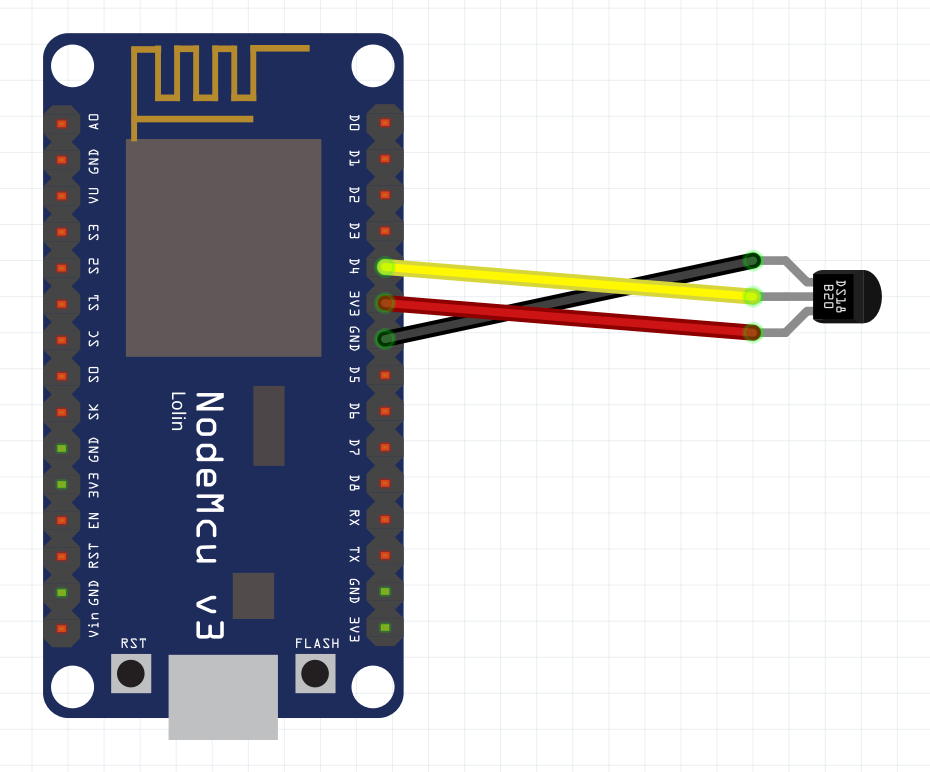

# wifitemp

Simple temperature sensor using NodeMCU board and ESP8266 lib for Arduino IDE. Ready for Homebridge integration.

## Connecting

Connect DS18B20 temperature sensor VCC to NodeMCU 3V3. D4 pin on NodeMCU has internal pull-up so this can be used for DS18B20 data line. Don't forget to connect GND.



## Compiling

You will need following to compile this sketch

* [ESP8266 Arduino Core](https://github.com/esp8266/Arduino)
* [TaskScheduler library](https://github.com/arkhipenko/TaskScheduler)
* [WiFiManager library](https://github.com/tzapu/WiFiManager)
* [OneWire library](https://github.com/PaulStoffregen/OneWire)

## Homebridge integration

Use [homebridge-http-temperature](https://github.com/metbosch/homebridge-http-temperature) plugin.

Sample config for this sensor:


```
"accessories": [
    {
        "accessory": "HttpTemperature",
        "name": "Wifitemp",
        "url": "http://192.168.1.100/temp",
        "min_temp": -25,
        "max_temp": 75,
        "update_interval": 28000
    }
]
```
